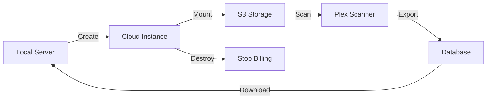

# 🚀 Plex Cloud Scanner

**Scan your massive Plex media library in the cloud for less than $1**

Delegate heavy Plex media scanning to a powerful cloud instance, then bring back only the database to your local server. Perfect for low-power home servers (Raspberry Pi, ZimaBoard, NAS) with large media libraries.

## ⚡ The Problem

- Your home server is too weak to scan 9TB+ of media files
- Full library scans take days and make your server unusable
- Your media is already in cloud storage (S3, Backblaze, etc.)
- You want to keep streaming locally but scan in the cloud

## ✨ The Solution

This tool automatically:
1. Spins up a powerful cloud instance (Scaleway)
2. Mounts your cloud storage (S3/rclone)
3. Runs Plex to scan your entire library
4. Downloads the generated database
5. Destroys the instance (stops billing)
6. Applies the database to your local Plex

**Result**: 6-hour cloud scan for ~$1 instead of 3-day local scan

## 📋 Prerequisites

- [Scaleway account](https://www.scaleway.com/fr/cli/) with CLI configured (`scw init`)
- Cloud storage with your media (S3, Backblaze B2, etc.)
- [rclone](https://rclone.org/) configured for your storage
- Python 3.7+
- Local Plex Media Server

## 🛠️ Installation

1. **Clone the repository**
```bash
git clone https://github.com/yourusername/plex-cloud-scanner.git
cd plex-cloud-scanner
```

2. **Configure your environment**
```bash
# Copy and edit environment variables
cp .env.example .env
nano .env
```

3. **Set up your rclone config**
```bash
# Interactive configuration
rclone config

# Or copy existing config
cp ~/.config/rclone/rclone.conf ./
```

4. **Configure your Plex libraries**
```bash
# Edit the libraries to match your setup
nano plex_libraries.json
```

## 🚀 Usage

### Quick Test (< 50GB)
```bash
# Use a small test bucket first
export INSTANCE_TYPE="DEV1-S"  # Cheap instance
source .env
python3 automate_scan.py
```

### Full Scan (9TB+)
```bash
# Production scan
export INSTANCE_TYPE="GP1-M"  # Powerful instance
source .env
python3 automate_scan.py
```

The script will:
- ✅ Create cloud instance
- ✅ Mount your S3 storage
- ✅ Configure Plex libraries
- ✅ Run the scan
- ✅ Download the database
- ✅ Destroy the instance

### Apply to Local Plex
```bash
# On your local server
./update_zimaboard.sh plex_metadata_20240120_143022.tar.gz
```

## 📁 Project Structure

```
plex-cloud-scanner/
├── automate_scan.py       # Main orchestration script
├── setup_instance.sh      # Cloud-init configuration
├── create_instance.sh       # Test - Create an instance
├── destroy_instance.sh      # Test - Destroy an instance
├── rclone.conf           # Your S3 configuration
├── plex_libraries.json   # Your Plex library setup
├── .env                  # Environment variables
└── update_zimaboard.sh   # Apply DB to local server
```

## ⚙️ Configuration Files

### `.env` - Environment Variables
```bash
# === INSTANCE SCALEWAY ===
export INSTANCE_TYPE="GP1-XS"  # DEV1-S (test) ou GP1-M (prod)
export PLEX_VERSION="latest"   # ou version spécifique comme "1.32.8.7639-fb6452ebf"

# === LOCAL (pour après le scan) ===
# Ces variables sont pour la phase APRÈS le scan cloud,
# quand vous voulez appliquer la DB sur votre ZimaBoard

# IP du ZimaBoard (pour copier l'archive après)
export ZIMABOARD_IP="192.168.1.0"

# Chemin vers le dossier config Plex sur le ZimaBoard
# Exemples selon votre installation :
# - Docker : /path/to/docker/volumes/plex/config
# - Natif : /var/lib/plexmediaserver
# - Synology : /volume1/docker/plex/config
export PLEX_CONFIG_PATH="/var/lib/plexmediaserver"
```

### `plex_libraries.json` - Library Configuration
```json
[
  {
    "title": "Movies",
    "type": "movie",
    "agent": "tv.plex.agents.movie",
    "scanner": "Plex Movie",
    "language": "en-US",
    "paths": ["/Media/Movies"]
  }
]
```

## 🔍 How It Works



## 🐛 Troubleshooting

**Instance won't start**
- Check Scaleway quotas
- Verify `scw init` configuration

**S3 mount fails**
- Test with `rclone ls your-remote:`
- Check credentials in rclone.conf

**Scan takes too long**
- Use more powerful instance (GP1-L)
- Disable thumbnail generation
- Split into multiple libraries

**Database import fails**
- Stop Plex before importing
- Check file permissions
- Verify paths match

## 🤝 Contributing

Pull requests welcome! Please open an issue first to discuss changes.

## ⚠️ Important Notes

- Always test with a small media subset first
- The cloud instance is temporary and will be destroyed
- Your actual media files stay in S3, only metadata is downloaded
- Make a backup of your local Plex database before importing
